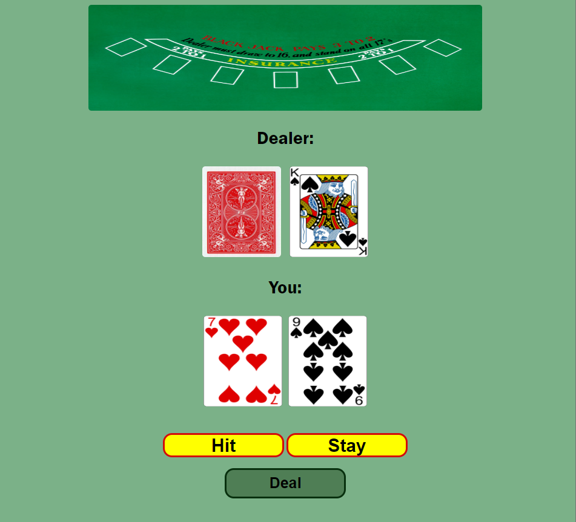

The Objective of Blackjack......Beat The Dealer!
 
*Card Values: 
  In Blackjack, numbered cards (2 to 10) are worth their face value, face cards (Jack, Queen, King) are worth 10, and Aces can be worth 1 or 11, whichever is more advantageous for the hand.

 
*How do you beat the dealer?
   Get a hand value as close to 21 as possible without exceeding it, while also having a higher hand value than the dealer.

*Game Setup: The dealer will shuffle a standard deck of 52 cards. Each player, including the dealer, will receive two cards.

*Player's Turn: 
  Players take turns to make decisions about their hand.  The possible actions are:

  Hit: Receive an additional card to try and improve the hand value.
  Stand: Keep the current hand value and end the turn.

*Dealer's Turn: 
  After all players have finished their turns, the dealer reveals their face-down card. The dealer must follow a strict rule: they must hit until they have a hand value of 17 or more. If the dealer's hand exceeds 21, all remaining players win.

*Winning Conditions: 
  At the end of the round, the player wins if:

  Their hand value is closer to 21 than the dealer's hand value.
  The dealer busts (exceeds 21), and the player does not.

*Losing Conditions: The player loses if:

  Their hand value exceeds 21 (bust).
  The dealer's hand value is closer to 21.
  The dealer and player have the same hand value (push/tie).
  Blackjack: If a player's first two cards are an Ace and a 10-value card (10, Jack, Queen, or King), they have a "Blackjack." A Blackjack automatically wins, except against the dealer's Blackjack, which results in a push.

*Next Round: 
  After determining the winners and losers, a new round begins with players placing their bets again.
 
<!--  -->

